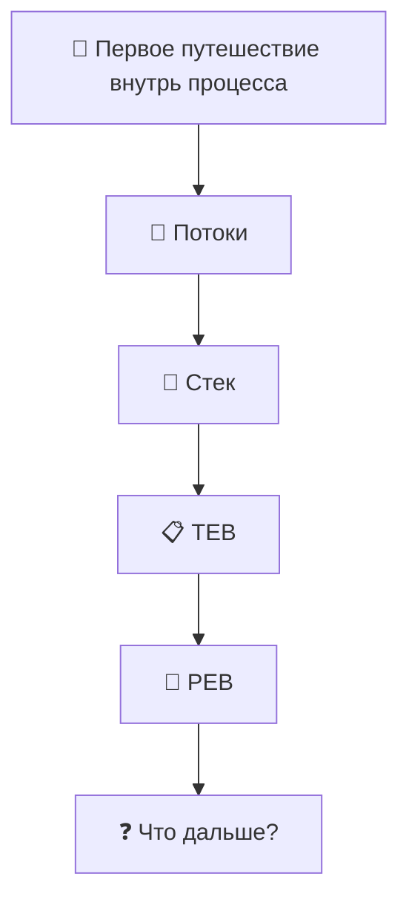

# Windows-Internals-Journey
From WinDbg commands to understanding how Windows really works.

---

# 🗺 Карта путешествия

---

# 🚀 Глава 1. Первое путешествие внутрь процесса

## Зачем нужен дамп процесса?

...
