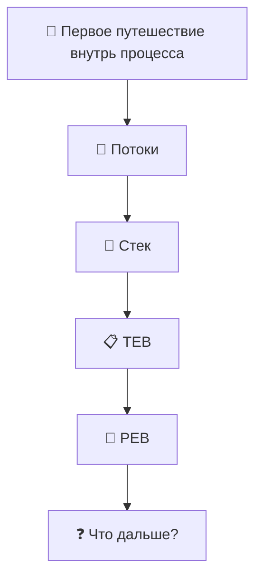

# Windows-Internals-Journey
From WinDbg commands to understanding how Windows really works.

---

# 🗺 Карта путешествия



---

# 🚀 Глава 1. Первое путешествие внутрь процесса

> [!NOTE]
>
> **Что мы исследуем в этой главе**
>
> После завершения главы вы сможете:
>
> - понять, зачем нужен дамп процесса;
> - открыть дамп в WinDbg;
> - найти потоки процесса;
> - определить главный поток;
> - посмотреть стек вызовов;
> - познакомиться со структурами TEB и PEB;
> - понять, как постепенно исследовать внутреннее устройство Windows.

---

## Почему именно так начинается эта книга?

Большинство книг по WinDbg начинают обучение со списка команд.

Например:

- `!process`
- `!thread`
- `!peb`
- `!teb`

Проблема такого подхода в том, что команды очень быстро забываются.

Мы решили пойти другим путём.

Вместо изучения команд мы будем исследовать настоящие процессы Windows.

Каждая команда WinDbg будет использоваться только тогда, когда она действительно понадобится для ответа на возникший вопрос.

Мы не изучаем WinDbg.

Мы исследуем Windows с помощью WinDbg.

---

## Почему именно `winlogon.exe`?

Для первого исследования мы выбрали процесс **winlogon.exe**.

Это один из ключевых процессов Windows, который отвечает за:

- вход пользователя в систему;
- блокировку и разблокировку компьютера;
- обработку безопасной последовательности клавиш (Ctrl+Alt+Delete);
- запуск пользовательской оболочки после успешной аутентификации.

Другими словами, это настоящий системный процесс, который постоянно работает на любом компьютере под управлением Windows.

Он идеально подходит для первого знакомства с внутренним устройством процессов.

---

## Первое правило исследования

Во время путешествия мы будем придерживаться одного очень важного правила.

> **Не пытаться понять всё сразу.**

Если во время исследования мы встречаем новую структуру или неизвестный термин, мы не перепрыгиваем через несколько глав вперёд.

Мы лишь фиксируем находку и продолжаем двигаться шаг за шагом.

Именно так работают инженеры.

Не существует человека, который знает устройство Windows целиком.

Даже разработчики Windows изучают систему постепенно.

Поэтому наша цель — не выучить всё за один день.

Наша цель — научиться самостоятельно исследовать Windows.

---

## Наш первый объект исследования

Мы открыли дамп процесса **winlogon.exe**.

В этот момент мы ещё ничего не знаем.

Перед нами просто содержимое памяти процесса.

Возникает вполне логичный вопрос.

> **С чего вообще начать исследование?**

Если представить процесс как большое офисное здание, то первым делом хочется узнать:

- сколько сотрудников сейчас работает;
- чем они занимаются;
- кто выполняет основную работу;
- кто просто ожидает новых задач.

В Windows роль таких сотрудников выполняют **потоки** (*Threads*).

Именно с них мы и начнём наше путешествие.

## Первое открытие. Внутри процесса живёт не один поток

Когда мы впервые открываем дамп процесса, возникает вполне естественный вопрос.

> Что сейчас делает этот процесс?

На первый взгляд кажется, что процесс выполняет какую-то одну задачу.

Но это не совсем так.

Сам **процесс** ничего не выполняет.

Процесс можно представить как офис.

В этом офисе находятся:

- память;
- загруженные библиотеки (DLL);
- различные объекты Windows;
- дескрипторы;
- и самое главное — сотрудники, которые выполняют работу.

Этими сотрудниками являются **потоки** (*Threads*).

Именно поток выполняет инструкции процессора.

Именно поток вызывает функции Windows.

Именно поток может ждать события, читать файл, работать по сети или выполнять вычисления.

Процесс лишь предоставляет потоку всё необходимое для работы.

Поэтому первым делом мы решили посмотреть, сколько потоков находится внутри процесса.

---

## Ищем потоки

Для просмотра потоков текущего процесса используется очень простая команда.

```text
~
```

После выполнения команды WinDbg выводит список всех потоков процесса.

Например:

```text
0:000> ~

.  0  Id: 7564.6ecc Suspend: 0 Teb: 00000081`3beaf000 Unfrozen
   1  Id: 7564.5038 Suspend: 0 Teb: 00000081`3bebf000 Unfrozen
   2  Id: 7564.bb58 Suspend: 0 Teb: 00000081`3be62000 Unfrozen
```

На первый взгляд эта информация выглядит пугающе.

Но если внимательно посмотреть, становится понятно, что здесь нет ничего лишнего.

Разберём каждое поле отдельно.

| Поле | Что означает |
|------|--------------|
| **0, 1, 2** | Номер потока внутри WinDbg. Используется для переключения между потоками. |
| **Id: 7564.6ecc** | Идентификатор процесса и идентификатор потока. Первая часть (`7564`) — PID процесса, вторая (`6ecc`) — TID потока (в шестнадцатеричном виде). |
| **Suspend: 0** | Поток не приостановлен. |
| **Teb:** | Адрес структуры TEB (Thread Environment Block) данного потока. Пока просто запомним это поле. Позже мы подробно исследуем TEB. |
| **Unfrozen** | Поток активен и не заморожен отладчиком. |

---

## Первое наблюдение

Самое интересное открытие здесь заключается вовсе не в числах.

Мы увидели, что внутри процесса существует **несколько потоков**.

То есть процесс — это не один поток.

Это контейнер, внутри которого одновременно могут работать несколько независимых потоков.

Каждый поток имеет:

- собственный стек;
- собственный TEB;
- собственный идентификатор;
- собственное текущее состояние.

При этом все потоки совместно используют память одного процесса.

Именно поэтому Windows может выполнять сразу несколько задач внутри одного процесса.

---

## Возникает новый вопрос

Теперь мы знаем, что внутри процесса находятся несколько потоков.

Но пока совершенно непонятно:

- какой поток выполняет основную работу;
- чем отличаются эти потоки;
- что каждый из них делает прямо сейчас.

Чтобы ответить на этот вопрос, нам нужно научиться переключаться между потоками.

Именно этим мы займёмся в следующем разделе.


## Второе открытие. Можно заглянуть внутрь каждого потока

Мы выяснили, что внутри процесса находится несколько потоков.

Но остаётся главный вопрос.

> Чем они отличаются друг от друга?

Чтобы ответить на него, необходимо научиться переключаться между потоками.

Для этого используется команда:

```text
~0s
```

Здесь:

- `0` — номер потока из списка, который показала команда `~`;
- `s` — сокращение от **Set Current Thread** (*сделать текущим*).

После выполнения команды WinDbg начинает работать именно с выбранным потоком.

Все последующие команды будут относиться уже к нему.

Например, переключимся на поток `0`.

```text
0:000> ~0s
```

Теперь текущим стал первый поток процесса.

Таким же образом можно перейти на любой другой поток.

Например:

```text
~1s
```

или

```text
~2s
```

---

## Почему это важно?

Представьте большое офисное здание.

Мы уже знаем, что в нём работают несколько сотрудников.

Но пока стоим в коридоре.

Команда `~` лишь показала список всех сотрудников.

Команда `~0s` позволяет открыть дверь в кабинет конкретного сотрудника.

После этого мы начинаем наблюдать только за его работой.

Именно поэтому почти все исследования в WinDbg начинаются с выбора интересующего потока.

---

## Но что именно делает поток?

После переключения возникает новый вопрос.

> Чем сейчас занимается этот поток?

Работает?

Выполняет вычисления?

Читает файл?

Ожидает какое-нибудь событие?

Где вообще можно это увидеть?

Ответ оказался удивительно простым.

Каждый поток всегда знает, **какие функции он выполняет прямо сейчас**.

Нужно лишь посмотреть его стек вызовов.

Именно это мы исследуем дальше.

## Третье открытие. Поток всегда оставляет след

Представим обычную жизненную ситуацию.

Ты звонишь коллеге и спрашиваешь:

> — Что ты сейчас делаешь?

Он отвечает:

> — Сейчас оформляю отчёт.

Ты продолжаешь спрашивать.

> — А зачем?

— Потому что бухгалтерия запросила данные.

> — А почему бухгалтерия их запросила?

— Потому что заканчивается месяц.

Получается небольшая цепочка событий.

```
Заканчивается месяц
        ↓
Бухгалтерия запросила данные
        ↓
Я оформляю отчёт
```

По этой цепочке можно понять не только **что человек делает сейчас**, но и **почему он оказался именно здесь**.

С потоком Windows происходит практически то же самое.

Каждая функция вызывает следующую.

Та вызывает ещё одну.

Та — следующую.

Получается своеобразная история путешествия потока.

Windows хранит эту историю в специальной области памяти, которая называется **стеком** (*Stack*).

---

## Что такое стек?

Не будем пока использовать сложные определения.

Представим стопку листов бумаги.

Каждый раз, когда вызывается новая функция, сверху кладётся новый лист.

Когда функция заканчивает работу, верхний лист снимается.

Именно поэтому стек всегда показывает путь, по которому поток пришёл в текущую точку выполнения.

```
+------------------------------+
| Текущая функция              |  ← верх стека
+------------------------------+
| Кто её вызвал                |
+------------------------------+
| Кто вызвал предыдущую        |
+------------------------------+
| Кто начал всю цепочку        |
+------------------------------+
```

Получается интересная особенность.

Стек отвечает не только на вопрос:

> **Что делает поток?**

Но и на вопрос:

> **Как он сюда попал?**

---

## Смотрим стек потока

После выбора нужного потока достаточно выполнить команду:

```text
k
```

Например:

```text
0:000> k
```

WinDbg выводит цепочку функций, которую в данный момент выполняет выбранный поток.

В нашем случае главный поток выглядел так.

```text
00 ntdll!NtWaitForSingleObject

01 KERNELBASE!WaitForSingleObjectEx

02 winlogon!SignalManagerWaitForSignal

03 winlogon!StateMachineRun

04 winlogon!WinMain

05 winlogon!__mainCRTStartup

06 kernel32!BaseThreadInitThunk

07 ntdll!RtlUserThreadStart
```

На первый взгляд это выглядит как случайный набор названий.

Но если читать его снизу вверх, начинает проявляться настоящая история работы потока.

---

## Почему снизу вверх?

Когда поток только появляется, Windows создаёт его и запускает функцию:

```
RtlUserThreadStart
```

Она передаёт управление функции:

```
BaseThreadInitThunk
```

Та запускает функцию:

```
__mainCRTStartup
```

После чего начинает работать сама программа:

```
WinMain
```

Затем приложение вызывает свои внутренние функции.

В нашем случае это были:

```
StateMachineRun
```

↓

```
SignalManagerWaitForSignal
```

↓

```
WaitForSingleObjectEx
```

↓

```
NtWaitForSingleObject
```

Именно здесь поток остановился.

Получается удивительная вещь.

Стек — это не просто список функций.

Это история того, как поток шаг за шагом пришёл в своё текущее состояние.

---

## Первое настоящее открытие

До этого момента нам казалось, что поток либо работает, либо не работает.

Но стек показал гораздо больше.

Мы увидели, **почему** поток сейчас ничего не делает.

Он не завис.

Он **ожидает событие**.

Это совершенно нормальное состояние для системного процесса.

Windows не заставляет процесс постоянно расходовать процессорное время.

Если делать нечего, поток просто засыпает и ждёт следующего события.

Именно поэтому процесс `winlogon.exe` большую часть времени находится в ожидании.

Он просыпается только тогда, когда пользователь выполняет действие, требующее его участия.

---

## Возникает новый вопрос

Мы выяснили, чем занимается поток.

Но появляется новая загадка.

> Где Windows хранит всю информацию именно об этом потоке?

В выводе команды `~` мы уже видели загадочное поле:

```text
Teb: 000000813beaf000
```

Пока мы лишь запомнили этот адрес.

Настало время открыть эту дверь.

## Четвёртое открытие. У каждого потока есть своё рабочее место

Мы только что выяснили, чем занимается поток.

Но теперь возникает новый вопрос.

Если поток — это сотрудник нашего офиса, то где находятся его личные вещи?

Где Windows хранит информацию именно об этом потоке?

Во время просмотра списка потоков мы уже видели загадочное поле.

```text
0:000> ~

. 0 Id: 7564.6ecc Suspend: 0 Teb: 00000081`3beaf000 Unfrozen
```

До этого момента нас интересовало только количество потоков.

Теперь же наше внимание привлёк адрес после слова **Teb**.

```
00000081`3beaf000
```

Это не просто адрес памяти.

Это адрес структуры, которая принадлежит **только этому потоку**.

---

## Что такое TEB?

Представим большой офис.

У каждого сотрудника есть собственный рабочий стол.

На этом столе лежат:

- документы;
- заметки;
- телефон;
- личные инструменты;
- список текущих задач.

Другие сотрудники не пользуются этим столом.

Он принадлежит только одному человеку.

В Windows существует похожая идея.

У каждого потока есть собственная область памяти, которая хранит всю информацию именно о нём.

Эта структура называется **Thread Environment Block**, или просто **TEB**.

Можно представить её как рабочий стол потока.

```
Поток
   │
   ▼
+----------------------+
|         TEB          |
+----------------------+
| LastError            |
| Stack                |
| Thread Local Storage |
| PEB                  |
| ...                  |
+----------------------+
```

Каждый поток имеет собственный TEB.

Если в процессе десять потоков, то существует и десять разных TEB.

---

## Открываем TEB

Раз мы уже знаем адрес TEB, логично посмотреть, что находится внутри.

Для этого существует команда:

```text
!teb
```

После выполнения WinDbg выводит содержимое структуры текущего потока.

Например:

```text
0:000> !teb

TEB at 000000813beaf000

StackBase:  000000813bca0000
StackLimit: 000000813bc92000

ClientId:   7564 . 6ecc

PEB Address: 000000813beae000

LastErrorValue: 122
```

На экране появилось значительно больше информации.

Но сейчас нас интересуют всего четыре строки.

Именно они станут отправной точкой для следующих открытий.

---

## Первое знакомство с TEB

### ClientId

```text
ClientId: 7564 . 6ecc
```

Мы уже видели эти числа раньше.

Теперь становится понятно, что TEB действительно принадлежит именно этому потоку.

Здесь Windows хранит идентификатор процесса и идентификатор потока.

Получается, что TEB знает, кому он принадлежит.

---

### StackBase и StackLimit

```text
StackBase
StackLimit
```

Раньше мы говорили о стеке как об идее.

Теперь впервые видим его реальные границы в памяти.

Windows знает, где начинается стек потока и где он заканчивается.

Позже мы обязательно вернёмся к этим адресам и исследуем стек гораздо глубже.

---

### LastErrorValue

```text
LastErrorValue: 122
```

Вот здесь происходит первое маленькое чудо.

До этого момента ошибки Windows казались чем-то абстрактным.

Теперь мы видим, что поток буквально хранит последнюю ошибку внутри собственного TEB.

Именно отсюда функция `GetLastError()` получает своё значение.

То есть это уже не магия Windows.

Это обычное поле структуры.

---

### PEB Address

И наконец строка, которая изменила направление нашего исследования.

```text
PEB Address:
000000813beae000
```

До этого момента мы исследовали поток.

Но внезапно TEB показывает на совершенно другую структуру.

Получается удивительная картина.

```
Поток

↓

TEB

↓

PEB
```

Мы ещё не знаем, что такое PEB.

Но уже видим, что каждый поток знает, где находится информация обо всём процессе.

Это первый настоящий мост между потоком и процессом.

И именно через него мы продолжим наше путешествие.

