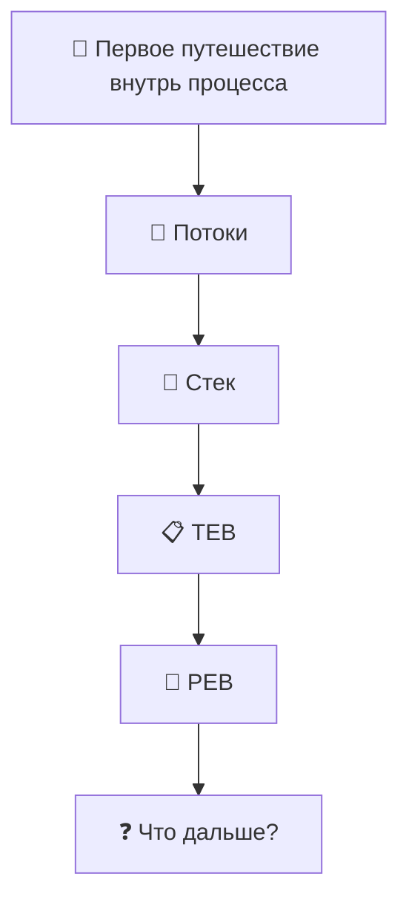

# Windows-Internals-Journey
From WinDbg commands to understanding how Windows really works.

---

# 🗺 Карта путешествия



---

# 🚀 Глава 1. Первое путешествие внутрь процесса

> *«Каждая структура — это не конец исследования.*
> *Это дверь в следующую структуру.»*

> [!NOTE]
>
> **Что мы исследуем в этой главе**
>
> После завершения главы вы сможете:
>
> - понять, зачем нужен дамп процесса;
> - открыть дамп в WinDbg;
> - найти потоки процесса;
> - определить главный поток;
> - посмотреть стек вызовов;
> - познакомиться со структурами TEB и PEB;
> - сделать первые открытия о том, как Windows устроена изнутри.

---

## Перед тем как начать

Когда мы только открыли первый дамп процесса, нам казалось, что WinDbg — это просто набор непонятных команд.

Мы видели адреса памяти.

Странные структуры.

Длинные списки полей.

И казалось, что разобраться во всём этом почти невозможно.

Но шаг за шагом выяснилось удивительное.

За каждым адресом скрывается не случайный набор байтов, а часть огромной системы, где всё связано между собой.

Именно это путешествие мы и начинаем.

Не будем пытаться запомнить команды.

Будем учиться понимать, **как думает Windows**.

---

## Почему именно так начинается эта книга?

Большинство книг по WinDbg начинают обучение со списка команд.

Например:

- `!process`
- `!thread`
- `!peb`
- `!teb`

Проблема такого подхода в том, что команды очень быстро забываются.

Мы решили пойти другим путём.

Вместо изучения команд мы будем исследовать настоящие процессы Windows.

Каждая команда WinDbg будет использоваться только тогда, когда она действительно понадобится для ответа на возникший вопрос.

Мы не изучаем WinDbg.

Мы исследуем Windows с помощью WinDbg.

---

## Почему именно `winlogon.exe`?

Для первого исследования мы выбрали процесс **winlogon.exe**.

Это один из ключевых процессов Windows, который отвечает за:

- вход пользователя в систему;
- блокировку и разблокировку компьютера;
- обработку безопасной последовательности клавиш (Ctrl+Alt+Delete);
- запуск пользовательской оболочки после успешной аутентификации.

Другими словами, это настоящий системный процесс, который постоянно работает на любом компьютере под управлением Windows.

Он идеально подходит для первого знакомства с внутренним устройством процессов.

---

## Первое правило исследования

Во время путешествия мы будем придерживаться одного очень важного правила.

> **Не пытаться понять всё сразу.**

Если во время исследования мы встречаем новую структуру или неизвестный термин, мы не перепрыгиваем через несколько глав вперёд.

Мы лишь фиксируем находку и продолжаем двигаться шаг за шагом.

Именно так работают инженеры.

Не существует человека, который знает устройство Windows целиком.

Даже разработчики Windows изучают систему постепенно.

Поэтому наша цель — не выучить всё за один день.

Наша цель — научиться самостоятельно исследовать Windows.

---

## Наш первый объект исследования

Мы открыли дамп процесса **winlogon.exe**.

В этот момент мы ещё ничего не знаем.

Перед нами просто содержимое памяти процесса.

Возникает вполне логичный вопрос.

> **С чего вообще начать исследование?**

Если представить процесс как большое офисное здание, то первым делом хочется узнать:

- сколько сотрудников сейчас работает;
- чем они занимаются;
- кто выполняет основную работу;
- кто просто ожидает новых задач.

В Windows роль таких сотрудников выполняют **потоки** (*Threads*).

Именно с них мы и начнём наше путешествие.

## Первое открытие. Внутри процесса живёт не один поток

Когда мы впервые открываем дамп процесса, возникает вполне естественный вопрос.

> Что сейчас делает этот процесс?

На первый взгляд кажется, что процесс выполняет какую-то одну задачу.

Но это не совсем так.

Сам **процесс** ничего не выполняет.

Процесс можно представить как офис.

В этом офисе находятся:

- память;
- загруженные библиотеки (DLL);
- различные объекты Windows;
- дескрипторы;
- и самое главное — сотрудники, которые выполняют работу.

Этими сотрудниками являются **потоки** (*Threads*).

Именно поток выполняет инструкции процессора.

Именно поток вызывает функции Windows.

Именно поток может ждать события, читать файл, работать по сети или выполнять вычисления.

Процесс лишь предоставляет потоку всё необходимое для работы.

Поэтому первым делом мы решили посмотреть, сколько потоков находится внутри процесса.

---

## Ищем потоки

Для просмотра потоков текущего процесса используется очень простая команда.

```text
~
```

После выполнения команды WinDbg выводит список всех потоков процесса.

Например:

```text
0:000> ~

.  0  Id: 7564.6ecc Suspend: 0 Teb: 00000081`3beaf000 Unfrozen
   1  Id: 7564.5038 Suspend: 0 Teb: 00000081`3bebf000 Unfrozen
   2  Id: 7564.bb58 Suspend: 0 Teb: 00000081`3be62000 Unfrozen
```

На первый взгляд эта информация выглядит пугающе.

Но если внимательно посмотреть, становится понятно, что здесь нет ничего лишнего.

Разберём каждое поле отдельно.

| Поле | Что означает |
|------|--------------|
| **0, 1, 2** | Номер потока внутри WinDbg. Используется для переключения между потоками. |
| **Id: 7564.6ecc** | Идентификатор процесса и идентификатор потока. Первая часть (`7564`) — PID процесса, вторая (`6ecc`) — TID потока (в шестнадцатеричном виде). |
| **Suspend: 0** | Поток не приостановлен. |
| **Teb:** | Адрес структуры TEB (Thread Environment Block) данного потока. Пока просто запомним это поле. Позже мы подробно исследуем TEB. |
| **Unfrozen** | Поток активен и не заморожен отладчиком. |

---

## Первое наблюдение

Самое интересное открытие здесь заключается вовсе не в числах.

Мы увидели, что внутри процесса существует **несколько потоков**.

То есть процесс — это не один поток.

Это контейнер, внутри которого одновременно могут работать несколько независимых потоков.

Каждый поток имеет:

- собственный стек;
- собственный TEB;
- собственный идентификатор;
- собственное текущее состояние.

При этом все потоки совместно используют память одного процесса.

Именно поэтому Windows может выполнять сразу несколько задач внутри одного процесса.

---

## Возникает новый вопрос

Теперь мы знаем, что внутри процесса находятся несколько потоков.

Но пока совершенно непонятно:

- какой поток выполняет основную работу;
- чем отличаются эти потоки;
- что каждый из них делает прямо сейчас.

Чтобы ответить на этот вопрос, нам нужно научиться переключаться между потоками.

Именно этим мы займёмся в следующем разделе.


## Второе открытие. Можно заглянуть внутрь каждого потока

Мы выяснили, что внутри процесса находится несколько потоков.

Но остаётся главный вопрос.

> Чем они отличаются друг от друга?

Чтобы ответить на него, необходимо научиться переключаться между потоками.

Для этого используется команда:

```text
~0s
```

Здесь:

- `0` — номер потока из списка, который показала команда `~`;
- `s` — сокращение от **Set Current Thread** (*сделать текущим*).

После выполнения команды WinDbg начинает работать именно с выбранным потоком.

Все последующие команды будут относиться уже к нему.

Например, переключимся на поток `0`.

```text
0:000> ~0s
```

Теперь текущим стал первый поток процесса.

Таким же образом можно перейти на любой другой поток.

Например:

```text
~1s
```

или

```text
~2s
```

---

## Почему это важно?

Представьте большое офисное здание.

Мы уже знаем, что в нём работают несколько сотрудников.

Но пока стоим в коридоре.

Команда `~` лишь показала список всех сотрудников.

Команда `~0s` позволяет открыть дверь в кабинет конкретного сотрудника.

После этого мы начинаем наблюдать только за его работой.

Именно поэтому почти все исследования в WinDbg начинаются с выбора интересующего потока.

---

## Но что именно делает поток?

После переключения возникает новый вопрос.

> Чем сейчас занимается этот поток?

Работает?

Выполняет вычисления?

Читает файл?

Ожидает какое-нибудь событие?

Где вообще можно это увидеть?

Ответ оказался удивительно простым.

Каждый поток всегда знает, **какие функции он выполняет прямо сейчас**.

Нужно лишь посмотреть его стек вызовов.

Именно это мы исследуем дальше.

## Третье открытие. Поток всегда оставляет след

Представим обычную жизненную ситуацию.

Ты звонишь коллеге и спрашиваешь:

> — Что ты сейчас делаешь?

Он отвечает:

> — Сейчас оформляю отчёт.

Ты продолжаешь спрашивать.

> — А зачем?

— Потому что бухгалтерия запросила данные.

> — А почему бухгалтерия их запросила?

— Потому что заканчивается месяц.

Получается небольшая цепочка событий.

```
Заканчивается месяц
        ↓
Бухгалтерия запросила данные
        ↓
Я оформляю отчёт
```

По этой цепочке можно понять не только **что человек делает сейчас**, но и **почему он оказался именно здесь**.

С потоком Windows происходит практически то же самое.

Каждая функция вызывает следующую.

Та вызывает ещё одну.

Та — следующую.

Получается своеобразная история путешествия потока.

Windows хранит эту историю в специальной области памяти, которая называется **стеком** (*Stack*).

---

## Что такое стек?

Не будем пока использовать сложные определения.

Представим стопку листов бумаги.

Каждый раз, когда вызывается новая функция, сверху кладётся новый лист.

Когда функция заканчивает работу, верхний лист снимается.

Именно поэтому стек всегда показывает путь, по которому поток пришёл в текущую точку выполнения.

```
+------------------------------+
| Текущая функция              |  ← верх стека
+------------------------------+
| Кто её вызвал                |
+------------------------------+
| Кто вызвал предыдущую        |
+------------------------------+
| Кто начал всю цепочку        |
+------------------------------+
```

Получается интересная особенность.

Стек отвечает не только на вопрос:

> **Что делает поток?**

Но и на вопрос:

> **Как он сюда попал?**

---

## Смотрим стек потока

После выбора нужного потока достаточно выполнить команду:

```text
k
```

Например:

```text
0:000> k
```

WinDbg выводит цепочку функций, которую в данный момент выполняет выбранный поток.

В нашем случае главный поток выглядел так.

```text
00 ntdll!NtWaitForSingleObject

01 KERNELBASE!WaitForSingleObjectEx

02 winlogon!SignalManagerWaitForSignal

03 winlogon!StateMachineRun

04 winlogon!WinMain

05 winlogon!__mainCRTStartup

06 kernel32!BaseThreadInitThunk

07 ntdll!RtlUserThreadStart
```

На первый взгляд это выглядит как случайный набор названий.

Но если читать его снизу вверх, начинает проявляться настоящая история работы потока.

---

## Почему снизу вверх?

Когда поток только появляется, Windows создаёт его и запускает функцию:

```
RtlUserThreadStart
```

Она передаёт управление функции:

```
BaseThreadInitThunk
```

Та запускает функцию:

```
__mainCRTStartup
```

После чего начинает работать сама программа:

```
WinMain
```

Затем приложение вызывает свои внутренние функции.

В нашем случае это были:

```
StateMachineRun
```

↓

```
SignalManagerWaitForSignal
```

↓

```
WaitForSingleObjectEx
```

↓

```
NtWaitForSingleObject
```

Именно здесь поток остановился.

Получается удивительная вещь.

Стек — это не просто список функций.

Это история того, как поток шаг за шагом пришёл в своё текущее состояние.

---

## Первое настоящее открытие

До этого момента нам казалось, что поток либо работает, либо не работает.

Но стек показал гораздо больше.

Мы увидели, **почему** поток сейчас ничего не делает.

Он не завис.

Он **ожидает событие**.

Это совершенно нормальное состояние для системного процесса.

Windows не заставляет процесс постоянно расходовать процессорное время.

Если делать нечего, поток просто засыпает и ждёт следующего события.

Именно поэтому процесс `winlogon.exe` большую часть времени находится в ожидании.

Он просыпается только тогда, когда пользователь выполняет действие, требующее его участия.

---

## Возникает новый вопрос

Мы выяснили, чем занимается поток.

Но появляется новая загадка.

> Где Windows хранит всю информацию именно об этом потоке?

В выводе команды `~` мы уже видели загадочное поле:

```text
Teb: 000000813beaf000
```

Пока мы лишь запомнили этот адрес.

Настало время открыть эту дверь.

## Четвёртое открытие. У каждого потока есть своё рабочее место

Мы только что выяснили, чем занимается поток.

Но теперь возникает новый вопрос.

Если поток — это сотрудник нашего офиса, то где находятся его личные вещи?

Где Windows хранит информацию именно об этом потоке?

Во время просмотра списка потоков мы уже видели загадочное поле.

```text
0:000> ~

. 0 Id: 7564.6ecc Suspend: 0 Teb: 00000081`3beaf000 Unfrozen
```

До этого момента нас интересовало только количество потоков.

Теперь же наше внимание привлёк адрес после слова **Teb**.

```
00000081`3beaf000
```

Это не просто адрес памяти.

Это адрес структуры, которая принадлежит **только этому потоку**.

---

## Что такое TEB?

Представим большой офис.

У каждого сотрудника есть собственный рабочий стол.

На этом столе лежат:

- документы;
- заметки;
- телефон;
- личные инструменты;
- список текущих задач.

Другие сотрудники не пользуются этим столом.

Он принадлежит только одному человеку.

В Windows существует похожая идея.

У каждого потока есть собственная область памяти, которая хранит всю информацию именно о нём.

Эта структура называется **Thread Environment Block**, или просто **TEB**.

Можно представить её как рабочий стол потока.

```
Поток
   │
   ▼
+----------------------+
|         TEB          |
+----------------------+
| LastError            |
| Stack                |
| Thread Local Storage |
| PEB                  |
| ...                  |
+----------------------+
```

Каждый поток имеет собственный TEB.

Если в процессе десять потоков, то существует и десять разных TEB.

---

## Открываем TEB

Раз мы уже знаем адрес TEB, логично посмотреть, что находится внутри.

Для этого существует команда:

```text
!teb
```

После выполнения WinDbg выводит содержимое структуры текущего потока.

Например:

```text
0:000> !teb

TEB at 000000813beaf000

StackBase:  000000813bca0000
StackLimit: 000000813bc92000

ClientId:   7564 . 6ecc

PEB Address: 000000813beae000

LastErrorValue: 122
```

На экране появилось значительно больше информации.

Но сейчас нас интересуют всего четыре строки.

Именно они станут отправной точкой для следующих открытий.

---

## Первое знакомство с TEB

### ClientId

```text
ClientId: 7564 . 6ecc
```

Мы уже видели эти числа раньше.

Теперь становится понятно, что TEB действительно принадлежит именно этому потоку.

Здесь Windows хранит идентификатор процесса и идентификатор потока.

Получается, что TEB знает, кому он принадлежит.

---

### StackBase и StackLimit

```text
StackBase
StackLimit
```

Раньше мы говорили о стеке как об идее.

Теперь впервые видим его реальные границы в памяти.

Windows знает, где начинается стек потока и где он заканчивается.

Позже мы обязательно вернёмся к этим адресам и исследуем стек гораздо глубже.

---

### LastErrorValue

```text
LastErrorValue: 122
```

Вот здесь происходит первое маленькое чудо.

До этого момента ошибки Windows казались чем-то абстрактным.

Теперь мы видим, что поток буквально хранит последнюю ошибку внутри собственного TEB.

Именно отсюда функция `GetLastError()` получает своё значение.

То есть это уже не магия Windows.

Это обычное поле структуры.

---

### PEB Address

И наконец строка, которая изменила направление нашего исследования.

```text
PEB Address:
000000813beae000
```

До этого момента мы исследовали поток.

Но внезапно TEB показывает на совершенно другую структуру.

Получается удивительная картина.

```
Поток

↓

TEB

↓

PEB
```

Мы ещё не знаем, что такое PEB.

Но уже видим, что каждый поток знает, где находится информация обо всём процессе.

Это первый настоящий мост между потоком и процессом.

И именно через него мы продолжим наше путешествие.

## Пятое открытие. TEB знает, где находится паспорт процесса

До этого момента всё выглядело вполне логично.

Мы исследовали поток.

Потом открыли его TEB.

Казалось бы, дальше мы должны продолжать изучать информацию только об этом потоке.

Но произошло неожиданное.

Среди полей TEB мы увидели строку:

```text
PEB Address: 000000813beae000
```

Возникает вопрос.

Почему структура, принадлежащая потоку, внезапно хранит адрес совершенно другой структуры?

И что вообще такое PEB?

---

## Представим большой офис

Продолжим нашу аналогию.

У каждого сотрудника есть собственный рабочий стол.

На нём лежат его документы, инструменты и личные записи.

Это наш **TEB**.

Но иногда сотруднику требуется информация не о себе, а обо всей компании.

Например:

- как называется компания;
- где находится главный склад;
- какие отделы существуют;
- какие правила действуют для всех сотрудников.

Было бы неудобно хранить эту информацию на каждом рабочем столе.

Гораздо логичнее иметь один общий паспорт компании.

И дать каждому сотруднику ссылку на него.

Именно так устроена Windows.

```
               Процесс
                   │
         +-------------------+
         |        PEB        |
         +-------------------+
             ▲      ▲      ▲
             │      │      │
          +------+ +------+ +------+
          | TEB  | | TEB  | | TEB  |
          +------+ +------+ +------+
             │        │        │
         Поток 0  Поток 1  Поток 2
```

Получается очень красивая архитектура.

Каждый поток имеет собственный TEB.

Но все TEB указывают на один общий PEB.

---

## Что означает PEB?

PEB расшифровывается как:

**Process Environment Block**

Если TEB можно представить как рабочий стол сотрудника,

то PEB — это паспорт процесса.

Именно здесь Windows хранит информацию, которая относится уже не к одному потоку, а ко всему процессу.

Например:

- адрес, по которому загружен процесс;
- список подключённых DLL;
- параметры запуска;
- кучу (Heap);
- различные внутренние структуры Windows.

Пока мы ещё не знаем, где именно находится вся эта информация.

Но уже понимаем главное.

Если хочется узнать что-нибудь обо всём процессе, искать нужно именно в PEB.

---

## Открываем паспорт процесса

Раз мы уже знаем адрес PEB, логично посмотреть, что находится внутри.

Для этого воспользуемся командой:

```text
dt ntdll!_PEB <адрес>
```

В нашем случае:

```text
dt ntdll!_PEB 000000813beae000
```

На экране появляется огромная структура.

Сотни строк.

Десятки полей.

На первый взгляд может показаться, что разобраться в этом невозможно.

Но именно здесь важно вспомнить правило нашего путешествия.

> **Мы не обязаны понимать всё сразу.**

Мы будем открывать только те двери, которые нужны нам именно сейчас.

Поэтому пока нас интересует всего одна строка.

```text
ProcessParameters :
0x000001dc`89105570 _RTL_USER_PROCESS_PARAMETERS
```

Мы ещё не знаем, что такое `RTL_USER_PROCESS_PARAMETERS`.

Но уже можем сделать первое наблюдение.

PEB не хранит все данные внутри себя.

Он хранит ссылки на другие структуры.

Получается, что PEB становится не просто паспортом процесса.

Он превращается в своеобразную карту, по которой можно путешествовать дальше.

## Перед тем как открыть следующую дверь...

Мы нашли поле:

```text
ProcessParameters
```

И сразу возникает желание открыть его.

Но давайте не будем спешить.

Представим, что мы никогда раньше не видели Windows изнутри.

У нас есть процесс.

Какую информацию о нём вообще должна хранить операционная система?

Попробуем предположить.

Если Windows запускает программу, ей необходимо где-то хранить ответы на простые вопросы.

Например:

> Как называется эта программа?

↓

> Откуда она была запущена?

↓

> С какой командной строкой её запустили?

↓

> В каком каталоге она сейчас работает?

↓

> Какие переменные окружения ей доступны?

↓

> Какие окна должна создавать программа?

↓

> Какие стандартные потоки ввода и вывода использовать?

Если задуматься, вся эта информация относится не к отдельному потоку.

Она относится сразу ко всему процессу.

Значит, где-то должна существовать структура, которая всё это хранит.

Именно её мы только что нашли.

```text
RTL_USER_PROCESS_PARAMETERS
```

Но действительно ли там находится именно эта информация?

Или мы ошибаемся?

Не будем гадать.

Проверим.

## Проверяем нашу гипотезу

Мы предполагаем, что именно `RTL_USER_PROCESS_PARAMETERS` хранит информацию о процессе.

Но пока это всего лишь предположение.

Посмотрим, что находится внутри.

В PEB мы уже нашли поле:

```text
ProcessParameters :
0x000001dc`89105570
```

Логично предположить, что именно этот адрес нужно открыть.

Но...

Здесь мы совершили свою первую настоящую ошибку.

Вместо адреса `ProcessParameters` мы случайно открыли сам PEB, указав его адрес как будто это была структура `RTL_USER_PROCESS_PARAMETERS`.

```text
dt ntdll!_RTL_USER_PROCESS_PARAMETERS 000000813beae000
```

Результат оказался очень странным.

Мы увидели непонятные символы.

Некоторые строки выглядели повреждёнными.

Часть полей вообще выдала ошибки чтения памяти.

Например:

```text
DllPath       : "楀???"

ImagePathName : "???"

CommandLine   : "@"

memory read error...
```

Сначала могло показаться, что дамп повреждён.

Но проблема оказалась совсем в другом.

Мы открыли правильную структуру...

по неправильному адресу.

---

Это стало первым важным уроком.

> WinDbg не знает, что находится по адресу памяти.

Он знает только то, как **мы попросили его интерпретировать содержимое памяти**.

Если открыть один и тот же адрес разными типами структур, результат тоже будет совершенно разным.

Это очень похоже на попытку прочитать паспорт человека как телефонную книгу.

Паспорт не испортился.

Просто мы использовали неправильный шаблон.

---

Исправив ошибку, мы открыли уже настоящий адрес `ProcessParameters`.

```text
dt ntdll!_RTL_USER_PROCESS_PARAMETERS 0x000001dc`89105570
```

И именно здесь произошло первое большое открытие.

## Что мы нашли внутри?

На этот раз WinDbg показал совсем другую картину.

Перед нами оказалась структура, наполненная вполне понятной информацией.

```text
ImagePathName : "C:\WINDOWS\system32\winlogon.exe"

CommandLine : "winlogon.exe"

Environment : 0x000001dc`891173e0

CurrentDirectory : _CURDIR

ProcessGroupId : 0x7564
```

Именно в этот момент произошло первое настоящее удивление.

Мы ожидали увидеть какие-то внутренние структуры Windows.

Вместо этого нашли вполне привычные вещи.

Windows действительно хранит информацию о процессе:

- путь к исполняемому файлу;
- командную строку запуска;
- переменные окружения;
- текущий рабочий каталог;
- другие параметры, необходимые процессу во время работы.

Мы ничего не предполагали.

Мы ничего не читали в документации.

Мы просто открыли память процесса и увидели всё своими глазами.

---

Но почти сразу возник новый вопрос.

Посмотрим ещё раз на одно из полей.

```text
ImagePathName :
_UNICODE_STRING "C:\WINDOWS\system32\winlogon.exe"
```

WinDbg уже показал нам готовую строку.

Но действительно ли сама строка хранится внутри структуры `UNICODE_STRING`?

Или WinDbg просто помог нам её прочитать?

Чтобы ответить на этот вопрос, придётся открыть ещё одну дверь.

Структуру `UNICODE_STRING`.

## Открываем следующую дверь

Наше внимание привлекло поле:

```text
ImagePathName : _UNICODE_STRING
```

WinDbg сразу показал нам готовый текст.

```text
"C:\WINDOWS\system32\winlogon.exe"
```

Это выглядело настолько естественно, что мы почти не задумались.

Но появился интересный вопрос.

Где на самом деле находится эта строка?

Неужели она хранится прямо внутри структуры `UNICODE_STRING`?

Или WinDbg показывает нам уже готовый результат?

Не будем гадать.

Посмотрим.

Открываем структуру:

```text
dt ntdll!_UNICODE_STRING <адрес>
```

В нашем случае:

```text
dt ntdll!_UNICODE_STRING 0x000001dc`891055d0
```

На экране появляется совсем небольшая структура.

```text
+0x000 Length           : 0x40
+0x002 MaximumLength    : 0x42
+0x008 Buffer           : 0x000001dc`89105bc8
```

Именно здесь произошло ещё одно большое открытие.

Мы ожидали увидеть сам текст.

Но текста внутри структуры не оказалось.

Вместо этого мы увидели всего три поля.

Сначала это выглядело странно.

Где же строка?

Почему WinDbg только что показывал её?

Ответ оказался спрятан в последнем поле.

```text
Buffer :
0x000001dc`89105bc8
```

Это не текст.

Это адрес памяти.

Получается, структура `UNICODE_STRING` вообще не хранит строку внутри себя.

Она хранит информацию о строке.

И самое главное — адрес, по которому эта строка находится.

## Идём по указателю

Мы нашли поле:

```text
Buffer :
0x000001dc`89105bc8
```

Пока это всего лишь адрес.

Мы ещё не знаем, что находится по нему.

Но именно этот адрес хранит `UNICODE_STRING`.

Если наша гипотеза верна, то именно здесь должна находиться настоящая строка.

Как это проверить?

Мы уже знаем адрес.

Значит, можно открыть память именно с этого места.

Для этого существует команда:

```text
du 0x000001dc`89105bc8
```

Результат оказался неожиданным.

```text
000001dc`89105bc8  "C:\WINDOWS\system32\winlogon.exe"
```

Именно здесь произошло ещё одно важное открытие.

WinDbg не показывал строку, находящуюся внутри структуры `UNICODE_STRING`.

Он сначала прочитал поле `Buffer`.

Потом перешёл по адресу, который находился в этом поле.

И только после этого прочитал символы Unicode из памяти.

Получается, когда мы видели

```text
ImagePathName :
"C:\WINDOWS\system32\winlogon.exe"
```

WinDbg немного помог нам.

На самом деле внутри структуры не было этой строки.

Она находилась совсем в другом месте памяти.

`UNICODE_STRING` лишь указывал, где её искать.

                RTL_USER_PROCESS_PARAMETERS
                           │
                           │
                           ▼
                   ImagePathName
                           │
                           ▼
                    UNICODE_STRING
          ┌────────────────────────────┐
          │ Length = 64                │
          │ MaximumLength = 66         │
          │ Buffer ────────────────┐   │
          └────────────────────────┼───┘
                                   │
                                   ▼
                     0x000001dc89105bc8
                                   │
                                   ▼
      "C:\WINDOWS\system32\winlogon.exe"

## Почему именно `du`?

Мы выполнили команду:

```text
du 0x000001dc`89105bc8
```

И неожиданно увидели знакомую строку:

```text
"C:\WINDOWS\system32\winlogon.exe"
```

На первый взгляд всё выглядело очевидно.

Мы нашли путь к исполняемому файлу.

Но действительно ли память хранит строку?

Или это только один из способов посмотреть на её содержимое?

Не будем спешить с выводами.

Проверим.

### Исследование

Мы решили открыть **один и тот же адрес памяти** несколькими разными командами WinDbg.

```text
du
db
dw
dd
dq
```

Если память действительно хранит строку, все команды должны показать примерно одно и то же.

Если же результаты окажутся разными — значит дело не в памяти, а в способе её просмотра.

### Один адрес — разные представления

Возьмём уже знакомый адрес.

```text
0x000001dc`89105bc8
```

Теперь посмотрим на него разными глазами.

#### `du`

```text
du 0x000001dc`89105bc8
```

Интерпретирует память как строку Unicode.

Поэтому мы увидели:

```text
"C:\WINDOWS\system32\winlogon.exe"
```

---

#### `db`

```text
db 0x000001dc`89105bc8
```

Показывает память побайтно.

Текст исчезает.

Перед нами остаются только отдельные значения каждого байта.

---

#### `dw`

```text
dw 0x000001dc`89105bc8
```

Читает память словами (`WORD`) по 2 байта.

Именно столько занимает один символ UTF-16.

---

#### `dd`

```text
dd 0x000001dc`89105bc8
```

Читает память двойными словами (`DWORD`) по 4 байта.

Строка начинает выглядеть как набор чисел.

---

#### `dq`

```text
dq 0x000001dc`89105bc8
```

Читает память блоками по 8 байт (`QWORD`).

Если по адресу хранится текст, читать его становится неудобно.

Но если память содержит указатели, именно `dq` становится одним из самых полезных инструментов исследования.

### Практика

Откройте один и тот же адрес памяти следующими командами.

```text
du <адрес>

db <адрес>

dw <адрес>

dd <адрес>

dq <адрес>
```

Не пытайтесь сразу разобраться во всех числах.

Вместо этого ответьте себе всего на три вопроса.

1. Какая команда оказалась наиболее понятной человеку?

2. Какая показала память наиболее подробно?

3. Что изменилось после выполнения каждой команды: содержимое памяти или только способ её отображения?

### Что мы выяснили

Эксперимент показал неожиданную вещь.

Все команды читали **один и тот же адрес памяти**.

Менялась не память.

Менялся только способ её интерпретации.

Память не знает, где находится строка, число или структура.

Для неё всё является обычной последовательностью байтов.

Именно WinDbg решает, **как показать эти байты человеку**.

### 🌟 Понимание

До этого момента могло казаться, что память хранит строки.

Теперь стало понятно, что это не так.

Строка существует только тогда, когда какая-либо программа интерпретирует последовательность байтов как текст.

Это относится не только к строкам.

Точно так же Windows работает с числами, структурами, указателями и практически всеми остальными объектами.

Мы сделали ещё один важный шаг.

Начали понимать не команды WinDbg.

А то, **как Windows смотрит на собственную память**.

## Возвращаемся к самому началу

Давайте ещё раз посмотрим на то, с чего всё началось.

В структуре `UNICODE_STRING` мы увидели:

```text
+0x000 Length           : 0x40
+0x002 MaximumLength    : 0x42
+0x008 Buffer           : 0x000001dc`89105bc8
```

Когда мы впервые открыли эту структуру, всё внимание было приковано к полю `Buffer`.

И это было совершенно естественно.

Именно оно привело нас к настоящей строке.

Но теперь, когда мы убедились, что `Buffer` действительно указывает на текст, можно посмотреть на структуру ещё раз.

В этот раз внимание привлекают два соседних поля.

```text
Length

MaximumLength
```

Они всё время находились перед нами.

Но мы практически не задавались вопросом, зачем они нужны.

Если адрес строки уже известен, почему Windows хранит ещё два числа?

Разве недостаточно одного указателя?

Windows редко хранит лишнюю информацию.

Если поле существует, значит оно решает какую-то задачу.

Не будем строить догадки.

Попробуем разобраться.

### Исследование

Мы внимательно посмотрели на значения этих полей.

```text
Length        : 0x40

MaximumLength : 0x42
```

Сразу бросается в глаза небольшая разница.

Всего два байта.

Почему?

Если оба поля относятся к одной и той же строке, почему их значения отличаются?

Пока не будем делать выводов.

Попробуем найти объяснение.

### 🌟 Понимание

Ответ оказался удивительно логичным.

Windows хранит строки в кодировке UTF-16.

Каждый символ занимает два байта.

Кроме самих символов, в конце строки всегда располагается специальный завершающий символ `\0`.

Он тоже занимает два байта.

Именно поэтому значения отличаются.

```text
Length        → размер текста

MaximumLength → размер всего буфера
                 вместе с завершающим символом
```

Но исследование привело нас к ещё более важному выводу.

`UNICODE_STRING` не хранит сам текст.

Она хранит его описание.

```text
Length
MaximumLength
Buffer
```

- `Buffer` — адрес, по которому находится строка.
- `Length` — длина строки в байтах.
- `MaximumLength` — размер всего выделенного буфера.

Мы начали замечать закономерность.

Windows почти никогда не хранит только сами данные.

Рядом почти всегда находится структура, которая их описывает.

Строка — лишь один из примеров.

Очень многие объекты Windows устроены похожим образом.

Это ещё один шаг к пониманию того, как Windows организует данные в памяти.

И именно поэтому исследование памяти всё больше напоминает путешествие по огромной сети связанных между собой структур.

До этого момента казалось, что `UNICODE_STRING` — это просто строка.

Но исследование показало совсем другую картину.

Структура не хранит сам текст.

Она хранит информацию о нём.

```text
Length
MaximumLength
Buffer
```

- `Buffer` — адрес, где находится строка.
- `Length` — длина текста в байтах.
- `MaximumLength` — размер выделенного буфера в байтах.

Во время исследования мы заметили интересную деталь.

```text
Length        : 0x40

MaximumLength : 0x42
```

Разница составляет всего **2 байта**.

Почему?

Ответ оказался неожиданно простым.

Windows хранит строки в кодировке UTF-16.

После последнего символа строки всегда находится специальный завершающий символ `\0`, который занимает 2 байта.

Получается, `Length` содержит длину самого текста, а `MaximumLength` — размер всего буфера, включая место для завершающего символа.

Это стало ещё одним важным открытием.

Windows почти никогда не работает с "голыми" данными.

Практически всегда рядом с данными хранится информация, описывающая их.

## Но мы ещё не ответили на один вопрос

К этому моменту мы уже убедились, что `UNICODE_STRING` сама не хранит текст.

Она хранит только его описание.

Одно из полей этой структуры постоянно приводило нас к настоящей строке.

```text
Buffer
```

Именно через него мы открыли память командой:

```text
du 0x000001dc`89105bc8
```

И увидели:

```text
"C:\WINDOWS\system32\winlogon.exe"
```

Кажется, что всё стало понятно.

Но если остановиться и задуматься, возникает ещё один вопрос.

Что такое `Buffer`?

Почему в этом поле хранится не сама строка, а какое-то шестнадцатеричное число?

Что означает этот адрес?

Не будем спешить с ответом.

Попробуем исследовать его так же, как исследовали всё до этого.

## Исследуем поле `Buffer`

До этого момента мы пользовались полем `Buffer`, почти не задумываясь, что оно означает.

Мы просто открывали адрес командой:

```text
du 0x000001dc`89105bc8
```

и получали строку.

Но что такое `Buffer`?

Строка?

Объект?

Или что-то ещё?

Вместо того чтобы искать ответ в документации, мы решили посмотреть, как сама Windows описывает эту структуру.

Для этого открыли описание `UNICODE_STRING`.

```text
dt ntdll!_UNICODE_STRING
```

WinDbg показал:

```text
+0x000 Length           : Uint2B
+0x002 MaximumLength    : Uint2B
+0x008 Buffer           : Ptr64 Wchar
```

Именно эта строка заставила нас остановиться.

Мы уже знали, что по адресу из `Buffer` находится строка.

Но теперь Windows подсказала нам ещё кое-что.

Поле имеет тип:

```text
Ptr64 Wchar
```

Возникает вопрос.

Что означает `Ptr64`?

### Исследование

Первой мыслью было, что `Ptr` может быть каким-то внутренним типом Windows.

Но это предположение быстро отпало.

Название слишком похоже на знакомое сокращение.

Мы попробовали расшифровать его самостоятельно.

```text
Ptr

↓

Pointer
```

И всё сразу встало на свои места.

`Buffer` оказался не строкой.

И даже не объектом.

Это **64-битный указатель**.

То есть поле хранит не сам текст, а адрес памяти, по которому этот текст находится.

Получается, `UNICODE_STRING` знает только, где искать строку.

Сама строка располагается в другом месте памяти.

### 🌟 Что мы выяснили

Во время исследования мы сделали ещё одно важное наблюдение.

Поле `Buffer` имеет тип:

```text
Ptr64 Wchar
```

Это можно прочитать буквально.

```text
Ptr64

↓

64-битный указатель

↓

на

↓

Wchar
```

То есть поле `Buffer` хранит **64-битный указатель на область памяти**, содержащую последовательность символов типа `WCHAR`, где каждый символ занимает **2 байта**.

Именно поэтому команда

```text
du <Buffer>
```

смогла открыть текст.

Она не читала содержимое структуры `UNICODE_STRING`.

Она перешла по адресу, который хранится в поле `Buffer`, и интерпретировала находящиеся там данные как последовательность символов Unicode.

Мы начали понимать ещё один фундаментальный принцип Windows.

Структуры очень редко содержат большие данные внутри себя.

Гораздо чаще они содержат ссылки на данные.

Именно эти связи объединяют отдельные структуры в единую систему.

## Мы смотрели не на структуру

Во время исследования произошло ещё одно важное изменение в нашем понимании.

Сначала казалось, что команда

```text
du <Buffer>
```

читает содержимое структуры `UNICODE_STRING`.

Но теперь мы понимаем, что это не так.

Структура заканчивается на поле `Buffer`.

Сам текст находится уже за её пределами.

Получается, после выполнения команды

```text
du <Buffer>
```

мы покидаем структуру `UNICODE_STRING` и переходим в совершенно другую область памяти.

Именно там хранится последовательность символов `WCHAR`.

Это очень важный момент.

До этого мы изучали содержимое структуры.

Теперь мы впервые вышли за её границы и начали исследовать память, на которую она ссылается.

## Следующий вопрос

Теперь перед нами появился новый вопрос.

Если `UNICODE_STRING` хранит только указатель...

И строка располагается в другом месте памяти...

Кто создал эту область памяти?

Кто решил, сколько байт необходимо выделить?

И почему структура знает только адрес, но не хранит данные внутри себя?

Ответы на эти вопросы приведут нас к следующему этапу исследования внутреннего устройства Windows.

# 🚀 Глава 2. Кто управляет памятью?
