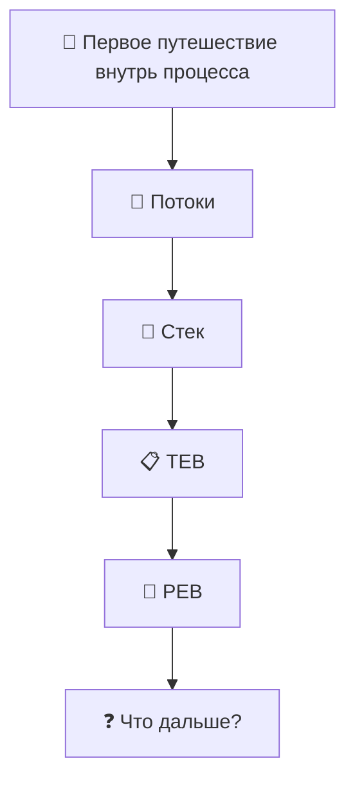

# Windows-Internals-Journey
From WinDbg commands to understanding how Windows really works.

---

# 🗺 Карта путешествия



---

---

# 🚀 Глава 1. Первое путешествие внутрь процесса

> [!NOTE]
>
> **Что мы исследуем в этой главе**
>
> После завершения главы вы сможете:
>
> - понять, зачем нужен дамп процесса;
> - открыть дамп в WinDbg;
> - найти потоки процесса;
> - определить главный поток;
> - посмотреть стек вызовов;
> - познакомиться со структурами TEB и PEB;
> - понять, как постепенно исследовать внутреннее устройство Windows.

---

## Почему именно так начинается эта книга?

Большинство книг по WinDbg начинают обучение со списка команд.

Например:

- `!process`
- `!thread`
- `!peb`
- `!teb`

Проблема такого подхода в том, что команды очень быстро забываются.

Мы решили пойти другим путём.

Вместо изучения команд мы будем исследовать настоящие процессы Windows.

Каждая команда WinDbg будет использоваться только тогда, когда она действительно понадобится для ответа на возникший вопрос.

Мы не изучаем WinDbg.

Мы исследуем Windows с помощью WinDbg.

---

## Почему именно `winlogon.exe`?

Для первого исследования мы выбрали процесс **winlogon.exe**.

Это один из ключевых процессов Windows, который отвечает за:

- вход пользователя в систему;
- блокировку и разблокировку компьютера;
- обработку безопасной последовательности клавиш (Ctrl+Alt+Delete);
- запуск пользовательской оболочки после успешной аутентификации.

Другими словами, это настоящий системный процесс, который постоянно работает на любом компьютере под управлением Windows.

Он идеально подходит для первого знакомства с внутренним устройством процессов.

---

## Первое правило исследования

Во время путешествия мы будем придерживаться одного очень важного правила.

> **Не пытаться понять всё сразу.**

Если во время исследования мы встречаем новую структуру или неизвестный термин, мы не перепрыгиваем через несколько глав вперёд.

Мы лишь фиксируем находку и продолжаем двигаться шаг за шагом.

Именно так работают инженеры.

Не существует человека, который знает устройство Windows целиком.

Даже разработчики Windows изучают систему постепенно.

Поэтому наша цель — не выучить всё за один день.

Наша цель — научиться самостоятельно исследовать Windows.

---

## Наш первый объект исследования

Мы открыли дамп процесса **winlogon.exe**.

В этот момент мы ещё ничего не знаем.

Перед нами просто содержимое памяти процесса.

Возникает вполне логичный вопрос.

> **С чего вообще начать исследование?**

Если представить процесс как большое офисное здание, то первым делом хочется узнать:

- сколько сотрудников сейчас работает;
- чем они занимаются;
- кто выполняет основную работу;
- кто просто ожидает новых задач.

В Windows роль таких сотрудников выполняют **потоки** (*Threads*).

Именно с них мы и начнём наше путешествие.

## Первое открытие. Внутри процесса живёт не один поток

Когда мы впервые открываем дамп процесса, возникает вполне естественный вопрос.

> Что сейчас делает этот процесс?

На первый взгляд кажется, что процесс выполняет какую-то одну задачу.

Но это не совсем так.

Сам **процесс** ничего не выполняет.

Процесс можно представить как офис.

В этом офисе находятся:

- память;
- загруженные библиотеки (DLL);
- различные объекты Windows;
- дескрипторы;
- и самое главное — сотрудники, которые выполняют работу.

Этими сотрудниками являются **потоки** (*Threads*).

Именно поток выполняет инструкции процессора.

Именно поток вызывает функции Windows.

Именно поток может ждать события, читать файл, работать по сети или выполнять вычисления.

Процесс лишь предоставляет потоку всё необходимое для работы.

Поэтому первым делом мы решили посмотреть, сколько потоков находится внутри процесса.

---

## Ищем потоки

Для просмотра потоков текущего процесса используется очень простая команда.

```text
~
```

После выполнения команды WinDbg выводит список всех потоков процесса.

Например:

```text
0:000> ~

.  0  Id: 7564.6ecc Suspend: 0 Teb: 00000081`3beaf000 Unfrozen
   1  Id: 7564.5038 Suspend: 0 Teb: 00000081`3bebf000 Unfrozen
   2  Id: 7564.bb58 Suspend: 0 Teb: 00000081`3be62000 Unfrozen
```

На первый взгляд эта информация выглядит пугающе.

Но если внимательно посмотреть, становится понятно, что здесь нет ничего лишнего.

Разберём каждое поле отдельно.

| Поле | Что означает |
|------|--------------|
| **0, 1, 2** | Номер потока внутри WinDbg. Используется для переключения между потоками. |
| **Id: 7564.6ecc** | Идентификатор процесса и идентификатор потока. Первая часть (`7564`) — PID процесса, вторая (`6ecc`) — TID потока (в шестнадцатеричном виде). |
| **Suspend: 0** | Поток не приостановлен. |
| **Teb:** | Адрес структуры TEB (Thread Environment Block) данного потока. Пока просто запомним это поле. Позже мы подробно исследуем TEB. |
| **Unfrozen** | Поток активен и не заморожен отладчиком. |

---

## Первое наблюдение

Самое интересное открытие здесь заключается вовсе не в числах.

Мы увидели, что внутри процесса существует **несколько потоков**.

То есть процесс — это не один поток.

Это контейнер, внутри которого одновременно могут работать несколько независимых потоков.

Каждый поток имеет:

- собственный стек;
- собственный TEB;
- собственный идентификатор;
- собственное текущее состояние.

При этом все потоки совместно используют память одного процесса.

Именно поэтому Windows может выполнять сразу несколько задач внутри одного процесса.

---

## Возникает новый вопрос

Теперь мы знаем, что внутри процесса находятся несколько потоков.

Но пока совершенно непонятно:

- какой поток выполняет основную работу;
- чем отличаются эти потоки;
- что каждый из них делает прямо сейчас.

Чтобы ответить на этот вопрос, нам нужно научиться переключаться между потоками.

Именно этим мы займёмся в следующем разделе.
