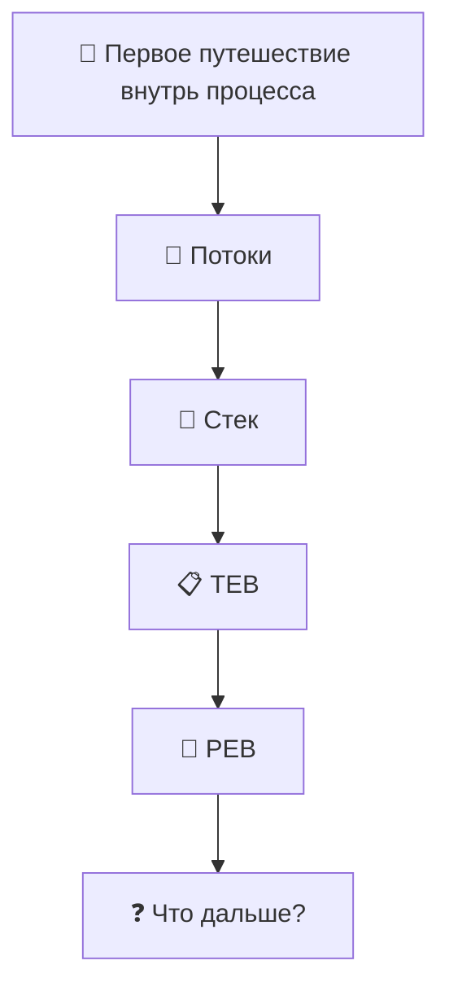

# Windows-Internals-Journey
From WinDbg commands to understanding how Windows really works.

---

# 🗺 Карта путешествия

---

---

# 🚀 Глава 1. Первое путешествие внутрь процесса

> [!NOTE]
>
> **Что мы исследуем в этой главе**
>
> После завершения главы вы сможете:
>
> - понять, зачем нужен дамп процесса;
> - открыть дамп в WinDbg;
> - найти потоки процесса;
> - определить главный поток;
> - посмотреть стек вызовов;
> - познакомиться со структурами TEB и PEB;
> - понять, как постепенно исследовать внутреннее устройство Windows.

---

## Почему именно так начинается эта книга?

Большинство книг по WinDbg начинают обучение со списка команд.

Например:

- `!process`
- `!thread`
- `!peb`
- `!teb`

Проблема такого подхода в том, что команды очень быстро забываются.

Мы решили пойти другим путём.

Вместо изучения команд мы будем исследовать настоящие процессы Windows.

Каждая команда WinDbg будет использоваться только тогда, когда она действительно понадобится для ответа на возникший вопрос.

Мы не изучаем WinDbg.

Мы исследуем Windows с помощью WinDbg.

---

## Почему именно `winlogon.exe`?

Для первого исследования мы выбрали процесс **winlogon.exe**.

Это один из ключевых процессов Windows, который отвечает за:

- вход пользователя в систему;
- блокировку и разблокировку компьютера;
- обработку безопасной последовательности клавиш (Ctrl+Alt+Delete);
- запуск пользовательской оболочки после успешной аутентификации.

Другими словами, это настоящий системный процесс, который постоянно работает на любом компьютере под управлением Windows.

Он идеально подходит для первого знакомства с внутренним устройством процессов.

---

## Первое правило исследования

Во время путешествия мы будем придерживаться одного очень важного правила.

> **Не пытаться понять всё сразу.**

Если во время исследования мы встречаем новую структуру или неизвестный термин, мы не перепрыгиваем через несколько глав вперёд.

Мы лишь фиксируем находку и продолжаем двигаться шаг за шагом.

Именно так работают инженеры.

Не существует человека, который знает устройство Windows целиком.

Даже разработчики Windows изучают систему постепенно.

Поэтому наша цель — не выучить всё за один день.

Наша цель — научиться самостоятельно исследовать Windows.

---

## Наш первый объект исследования

Мы открыли дамп процесса **winlogon.exe**.

В этот момент мы ещё ничего не знаем.

Перед нами просто содержимое памяти процесса.

Возникает вполне логичный вопрос.

> **С чего вообще начать исследование?**

Если представить процесс как большое офисное здание, то первым делом хочется узнать:

- сколько сотрудников сейчас работает;
- чем они занимаются;
- кто выполняет основную работу;
- кто просто ожидает новых задач.

В Windows роль таких сотрудников выполняют **потоки** (*Threads*).

Именно с них мы и начнём наше путешествие.
